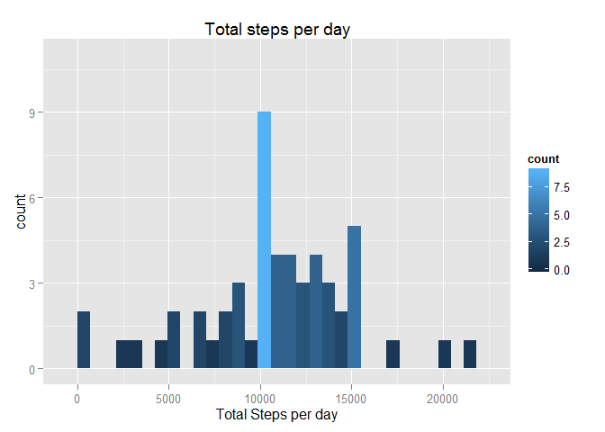
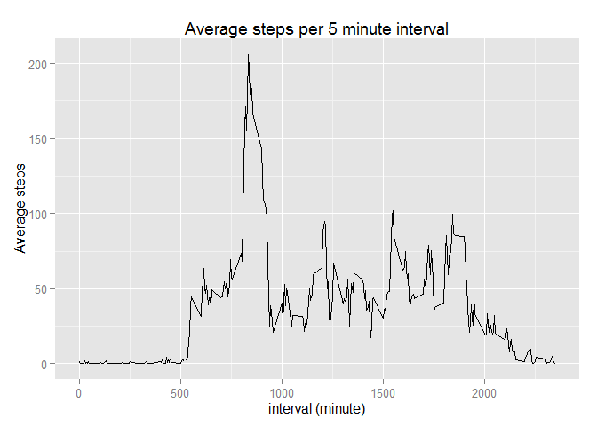
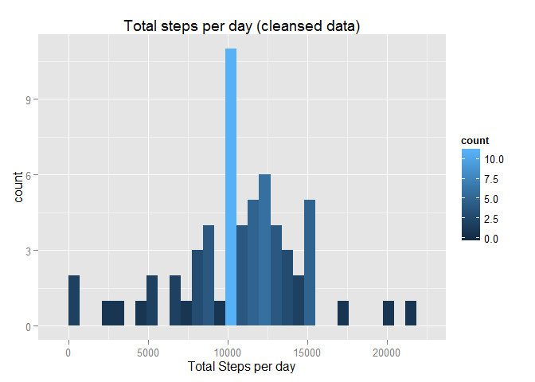
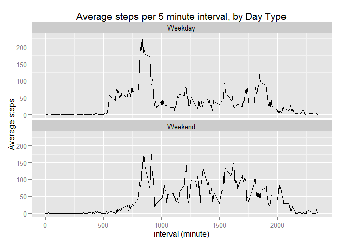

# Reproducible Research: Peer Assessment 1

This assignment attempts to answer some key questions about the activities recorded by a personal activity monitoring device.  The source data describes the numbers of steps taken by the wearer, by date and 5 minute increment for each day.

## Loading and preprocessing the data


```r
act <- read.csv("activity.csv")
#add Day of Week, Weekday/Weekend split
act$WeekDay <- strftime(act$date,'%A')
#add WeekDay/Weekend value
act$DayType <- "Weekday"
act[act$WeekDay=="Saturday" | act$WeekDay=="Sunday",]$DayType <- "Weekend"

#add transformed version of interval (hh:mm)
act$int_work <- paste("0000",as.character(act$interval),sep="")
act$int_print <- format(strptime(
    substr(act$int_work, nchar(act$int_work)-3,nchar(act$int_work)), format="%H%M")
  , format = "%H:%M")
```

## What is mean total number of steps taken per day?


```r
spd <- act %>% group_by(date) %>% summarise(Total_steps = sum(steps))
q<-ggplot(data=spd, aes(spd$Total_steps, fill=..count..)) +
  geom_histogram() +
  labs(title = "Total steps per day", x = "Total Steps per day") +
  ylim(c(0,11))
print(q)
```

 

```r
summary(spd$Total_steps, digits=7)
```

```
##     Min.  1st Qu.   Median     Mean  3rd Qu.     Max.     NA's 
##    41.00  8841.00 10765.00 10766.19 13294.00 21194.00        8
```


```r
ts_mean <- mean(spd$Total_steps, na.rm = TRUE)
ts_median <- median(spd$Total_steps, na.rm = TRUE)
```

The mean total number of steps per day is 10766.19 and the median total number of steps per day is 10765.

## What is the average daily activity pattern?


```r
spi <- act %>% 
    group_by(interval, int_print) %>% 
    summarise(Mean_steps = mean(steps, na.rm = TRUE))
q<-ggplot(data=spi, aes(spi$interval, spi$Mean_steps)) + 
    geom_line() + 
    labs(title = "Average steps per 5 minute interval", x = "interval (minute)", y="Average steps")
print(q)
```

 

```r
#build some summary vars
max_step <- max(spi$Mean_steps)
max_step_interval <- spi[spi$Mean_steps==max_step,]$int_print
```

The highest average steps per interval is 206.2 occuring during the 5 minute interval beginning at 08:35.

## Imputing missing values


```r
NArows = nrow(act[is.na(act$steps),])
```

There are 2304 NA rows (missing data) in the original dataset.  Missing data will be imputed by using the mean steps for the same interval and weekday, for non NA data.  This should smooth the data and not introduce any adverse trends.


```r
#Build a dataframe of average steps, by interval, by weekday
spdi <- act %>% 
    group_by(interval, WeekDay) %>% 
    summarise(Mean_steps = mean(steps, na.rm = TRUE))
#join to mean steps dataframe and impute $steps
act_cleanse <- inner_join(act, spdi, by=c("interval" = "interval", "WeekDay" = "WeekDay"))
act_cleanse$steps[is.na(act_cleanse$steps)] <- act_cleanse$Mean_steps

#Rebuild histogram using cleansed dataset
spd <- act_cleanse %>% group_by(date) %>% 
    summarise(Total_steps = sum(steps))
q<-ggplot(data=spd, aes(spd$Total_steps, fill=..count..)) +
    geom_histogram() +
    labs(title = "Total steps per day (cleansed data)", x = "Total Steps per day") +
    ylim(c(0,11))
print(q)
```

 

```r
summary(spd$Total_steps, digits=7)
```

```
##     Min.  1st Qu.   Median     Mean  3rd Qu.     Max. 
##    41.00  8918.00 10765.00 10765.31 12811.00 21194.00
```


```r
ts_cleanse_mean <- mean(spd$Total_steps, na.rm = TRUE)
ts_cleanse_median <- median(spd$Total_steps, na.rm = TRUE)
```

The mean total number of steps per day is 10765.31 and the median total number of steps per day is 10765.  Given the missing values were imputed from mean values, the mean and median values in the cleansed dataset have not moved by a significant amount.  The 1st and 3rd quartiles are affected slightly with the presence of more data.

## Are there differences in activity patterns between weekdays and weekends?


```r
spi <- act_cleanse %>% 
    group_by(DayType, interval, int_print) %>% 
    summarise(Mean_steps = mean(steps, na.rm = TRUE))
q<-ggplot(data=spi, aes(spi$interval, spi$Mean_steps)) + 
    geom_line() + 
    labs(title = "Average steps per 5 minute interval, by Day Type", 
    x = "interval (minute)", y="Average steps") +
    facet_wrap(~DayType, ncol=1)
print(q)
```

 

Activity is different between weekends and weekdays, noting the following differences:  
* activity begins earlier in the day on weekdays; on weekends little activity is shown prior to 08:00.  
* activity peaks early in the day, then does barely exceeds 100 steps per interval on weekdays; on weekends the profile shows more activity between 100 and 150 steps spread throughout the day  
* activity ends earlier in the day on weekdays, tapering off after 18:00; on weekends activity continues into the evening tapering off just after 20:00.

